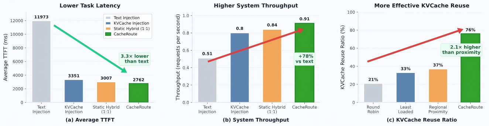

<p align="center">
  <b>Flexible KV cache reuse for knowledge-intensive LLM serving</b>
</p>

<p align="center">
  <i>Built on vLLM and LMCache. Designed for compute-network-aware knowledge injection across LLM systems.</i>
</p>

<p align="center">
  <a href="https://github.com/BJTU-ANT/CacheRoute/releases">
    
  </a>
  <a href="LICENSE">
    
  </a>
  <a href="https://github.com/vllm-project/vllm">
    
  </a>
  <a href="https://github.com/LMCache/LMCache">
    
  </a>
  
  
  
  
  
</p>

<p align="center">
  <a href="#why-cacheroute">Why CacheRoute?</a> •
  <a href="#key-features">Features</a> •
  <a href="#architecture">Architecture</a> •
  <a href="#quick-start">Quick Start</a> •
  <a href="#api-usage">API</a> •
  <a href="#documentation">Docs</a>
</p>

## CacheRoute

CacheRoute is a lightweight LLM scheduling framework built on [vLLM](https://github.com/vllm-project/vllm) and [LMCache](https://github.com/LMCache/LMCache) to enable flexible KV cache reuse across LLM systems. It targets knowledge-intensive LLM services, such as browser AI and knowledge QA systems, where many requests repeatedly use the same external knowledge. Existing systems usually prepend long knowledge texts to the user question and send the whole prompt to the model for recomputation. Although this approach helps reduce model hallucination and improve answer quality, it introduces heavy prefill overhead and causes redundant computation when the same knowledge appears across many requests.

CacheRoute addresses this problem by using KDN servers to store KVCache blocks for popular knowledge. For each request, CacheRoute dynamically chooses between text-based injection and KVCache-based injection according to task queues, compute load, and network load. In this way, CacheRoute shifts knowledge injection cost between compute and network resources, improving task latency and system throughput.

## Why CacheRoute?

- 🚀 **Less redundant prefill computation:** reuse repeated knowledge through KV cache instead of recomputing long prompts.
- 🔁 **Cross-system KV cache reuse:** share reusable knowledge across LLM systems through KDN servers.
- 🌐 **Compute-network coordination:** dynamically choose between recomputation and KV cache injection based on real-time resource load.

<p align="center">
  
</p>

<p align="center">
  <em>CacheRoute reduces average TTFT, improves system throughput, and enables more effective KVCache reuse under knowledge-intensive workloads.</em>
</p>

## Key Features

| Feature | Description |
|---|---|
| ⚙️ **Compute-network-aware knowledge injection** | CacheRoute dynamically chooses between text recomputation and KVCache reuse. It predicts task cost at the proxy and selects the injection strategy based on current task queues, compute load, and network load. |
| 🧭 **Knowledge-oriented cross-system routing** | CacheRoute parses the knowledge requirement before resource-pool scheduling. The scheduler jointly considers knowledge availability, system load, and topology information, and routes requests to the LLM system that can serve the required knowledge more efficiently. |
| 🗂️ **KDN-based KV cache management** | CacheRoute follows Knowledge Delivery Networks' idea, using dedicated KDN servers to register, store, query, and inject KV cache blocks for reusable knowledge. This enables external knowledge to be reused across LLM systems instead of being repeatedly recomputed. |
| 📊 **Optional Instance resource dashboard** | CacheRoute provides a Rust resource agent and a lightweight dashboard to visualize local Instance CPU, memory, GPU, network, and admission-state snapshots for validation. This dashboard does not drive Scheduler decisions yet. |

---

## Architecture

CacheRoute separates global routing, local injection decision, and KV cache management into Scheduler, Proxy, Instance, and KDN Server.

<p align="center">
  
</p>

- **Scheduler:** performs global resource-pool selection and knowledge-oriented task routing.
- **Proxy:** manages local task queues and selects the knowledge injection strategy.
- **Instance:** connects CacheRoute with vLLM + LMCache and handles execution signaling.
- **KDN Server:** stores reusable knowledge and injects KVCache blocks when needed.
- **Resource Agent/Dashboard:** optionally observes local Instance resource snapshots for validation and future control-plane integration.

### Default ports

| Component | Service Plane | Control Plane |
|---|---:|---:|
| Scheduler | 7001 | 7002 |
| Proxy | 8001 | 8002 |
| Instance | 9001 | - |
| vLLM | 8000 | - |
| KDN Server | 9101 | - |
| Resource Agent (optional) | 9201 | - |
| Resource Dashboard (optional) | 9202 | - |

### System Workflow

1. The Client sends an OpenAI-compatible request to the Scheduler.
2. The Scheduler analyzes the knowledge requirement and selects a target resource pool.
3. The Proxy predicts the cost of text-based and KVCache-based injection.
4. The KDN Server injects reusable KVCache blocks when KVCache reuse is selected.
5. The Instance forwards the request to vLLM + LMCache and returns the response.
6. Optionally, the Resource Agent and Dashboard visualize local Instance resource snapshots for debugging and validation.

---

## Requirements

CacheRoute has been tested with the following core environment:

| Component | Version |
|---|---|
| Python | 3.12.11 |
| Rust | stable toolchain, required for `instance/resource_agent` |
| Tkinter | `python3.12-tk`, required only for the desktop dashboard |
| vLLM | 0.13.x |
| LMCache | 0.3.x |
| PyTorch | 2.9.x |
| Redis | 7 |
| CUDA GPUs | Required for full LLM serving |

Install Python dependencies with:

```bash
pip install -r requirements.txt
```

For the recommended Docker-based environment, see [`env/README.md`](env/README.md). The CacheRoute Dockerfile installs Rust and Tkinter for the optional Instance Resource Agent/Dashboard.

---

## Quick Start

CacheRoute provides two ways to get started.

### Option 1: Lightweight Demo (without vLLM model)

Use the demo scripts to understand the CacheRoute scheduling workflow. Set `USE_MOCK = True` in the `core/config.py`.   

```bash
cd test

python3 demo_scheduler.py --cacheroute
python3 demo_kdn.py
python3 demo_proxy.py --strategy round_robin --injection-strategy iws --ready-release-policy text_bypass
python3 demo_instance.py --port 9001 --host 127.0.0.1
python3 demo_client.py --with-ui
```

Then, you can use the client_cli to send requests (see example in `API Usage`) to the scheduler and see the entire CacheRoute workflow.

### Option 2: Full CacheRoute Deployment

For full deployment with vLLM, LMCache, Redis, KDN warm-up, and KVCache injection, see:

- [`env/README.md`](env/README.md) for environment setup.
- [`kdn_server/README.md`](kdn_server/README.md) for KDN registration and KVCache injection.
- [`core/README.md`](core/README.md) for multi-machine configuration.

<details>
<summary>Full single-machine deployment guide</summary>
  
1. Place the whole CacheRoute project under `/workspace/`.<br>
2. Create a new container that supports vLLM. The required image is `cacheroute:vllm0.13-lmcache3.11-pytorch2.9.1` built from source. If you do not know how to quickly deploy the CacheRoute environment or download models, see `/env/README.md`.<br>
    ```bash
    sudo docker run --gpus all -it --name CacheRoute --network host --ipc=host --shm-size=64g --ulimit memlock=-1 --ulimit stack=67108864 --memory=0 --memory-swap=0 -p 8000:8000 -v /llm-stack:/workspace/llm-stack cacheroute:vllm0.13-lmcache3.11-pytorch2.9.1 bash
    ```
3. Start and enter the container. This is useful when you need to open multiple container terminals.
    ```bash
    sudo docker start CacheRoute 
    sudo docker exec -it CacheRoute bash
    ```
   First, start a Redis container as the later KVCache store for `LMcache_connector`.
    ```bash
    sudo docker run -d --name lmcache-redis --network host redis:7 redis-server --bind 0.0.0.0 --protected-mode no --save "" --appendonly no --maxmemory 200gb --maxmemory-policy allkeys-lru
    ```
4. Configure the required parameters in `core/config.py` according to the actual model download paths. The Scheduler strongly depends on the embedding model, tokenizer, and LLM model.
    ```text
    DEFAULT_MODEL:                               Path of the LLM to run
    DEFAULT_MODEL_SHORTNAME:                     Short name of the LLM, used by later vLLM startup commands
    SCHEDULER/PROXY/INSTANCE/KDN_LOG_FILE:       Log output paths of Scheduler/proxy/instance/kdn, <path-to-Cacheroute/log/**>
    EMBEDDING_MODEL:                             Actual path of the locally downloaded embedding model, <path-to-Cacheroute/model/embedder/**>
    DEFAULT_EMBED_MODEL:                         Embedding model name, used to download from Hugging Face when EMBEDDING_MODEL is not configured
    ...
    ```
   There are also many other parameters. See `core/config.py` for detailed descriptions, and see `test/demo_***` for usage examples.<br>
   To enable KVCache reuse across containers, CacheRoute replaces the unstable `builtin+SEED` key generation method with `sha256_cbor`. However, because of output format mismatch, CacheRoute patches `token_database.py`. Therefore, you need to replace `lmcache/v1/token_database.py` and `lmcache/v1/memory_management.py` in the LMCache source code with `CacheRoute/env/token_database.py` and `CacheRoute/env/memory_management.py`.<br>
   CacheRoute supports interconnection and scheduling across multi-level inference resource pools. For a quick demo on a single device, this tutorial uses a single-machine setup. It connects `scheduler`, `proxy`, `instance`, and `kdn_server` through loopback addresses and separates modules by ports. For multi-machine experiments, you need to modify the related configurations in `config.py` and demo scripts. See `core/README.md` for details.<br>
5. To enable the TTFT predictor in the Proxy, complete offline regression in advance, that is, profiling the model performance under different batch sizes and lengths, and then configure the predictor parameters. See `/instance/TTFT_predictor/README.md` for quickly collecting model regression data. See `proxy/metric` for Proxy predictor regression.
6. Start the vLLM 0.13 + LMCache 3.11 service without PD disaggregation. The following command starts a LLaMA-70B model with TP8. Adjust it according to your needs. Also make sure that `USE_MOCK = False` in `CacheRoute/core/config.py`.
    ```bash
    export CUDA_VISIBLE_DEVICES=0,1,2,3,4,5,6,7
    export PYTORCH_ALLOC_CONF=expandable_segments:True
    export MODEL_DIR=/workspace/llm-stack/models/LLM-Research/Meta-Llama-3-70B-Instruct
    export LMCACHE_CONFIG_FILE=/workspace/llm-stack/config/lmcache_with_redis.yaml
    export PYTHONHASHSEED=0
    export OMP_NUM_THREADS=8
    
    pkill -f vllm || true
    pkill -f api_server || true
    
    python3 -m vllm.entrypoints.openai.api_server \
      --model "$MODEL_DIR" \
      --served-model-name llama3-70b \
      --host 0.0.0.0 --port 8000 \
      --tensor-parallel-size 8 \
      --gpu-memory-utilization 0.75 \
      --dtype auto \
      --max-model-len 4096 \
      --max-num-seqs 8 \
      --max-num-batched-tokens 16384 \
      --kv-offloading-backend lmcache \
      --kv-offloading-size 64\
      --disable-hybrid-kv-cache-manager \
      --kv-cache-metrics
    ```
   Note that `LMCACHE_CONFIG_FILE` affects LMCache caching. CacheRoute needs to enable Redis-server-based KV caching. The current `lmcache.yaml` configuration is:
    ```yaml
    chunk_size: 256
    pre_caching_hash_algorithm: "sha256_cbor"

    local_cpu: true
    max_local_cpu_size: 80.0

    remote_url: "redis://127.0.0.1:6379"
    remote_serde: "cachegen"

    local_disk: null
    max_local_disk_size: 0

    save_decode_cache: false
    cache_policy: "LRU"
    numa_mode: null
    ```
7. Test whether the vLLM service starts correctly. Open a new container terminal and run:
    ```bash
    curl http://127.0.0.1:8000/v1/models
    ```
8. Prepare the environment and warm up the Scheduler knowledge list. First, install the dependencies in `requirements.txt` with `python -m pip install -r requirements.txt`.
9. Enter the `test` directory and start the CacheRoute Scheduler. See `/scheduler/README.md` for parameter options.
    ```bash
    python3 demo_scheduler.py --cacheroute --kdn-pending-overload-th 8 --kdn-active-overload-th 4 --kdn-queue-ms-overload-th 30 --cacheroute-log-decision 1
    ```
10. Warm up the KDN server. Run `demo_kdn.py` to start the KDN server through `kdn_api`. Then open a new terminal and run `kdn_register_cli.py` under `kdn_server`. This packaged interactive interface registers text and KVCache blocks by taking knowledge block texts as input, and then builds the knowledge base. See `kdn_server/README.md` for details.
11. After KDN warm-up, start the proxy, client, and instance demos in order. For local IDE debugging, you can directly use `demo_run`. **Note**: The startup order matters. The safest startup order is `[Scheduler]-[KDN_Server]-[Proxy]-[Instance]`. Also, the default Proxy injection strategy is `text`. After enabling the `iws` strategy, Proxy takes over injection strategy selection. In this case, the `Injection-type` sent by the client will be overwritten and become ineffective.
    ```bash
    python3 demo_proxy.py --strategy round_robin --injection-strategy iws --ready-release-policy text_bypass
    python3 demo_instance.py --port <default 9001> --host <xxx>
    python3 demo_client.py or demo_client.py --with-ui
    ```
   **Note**: If an import error occurs, add the project path to the container environment:
    ```bash
    echo 'export PYTHONPATH=/workspace/llm-stack/CacheRoute' >> ~/.bashrc
    ```
12. After the Scheduler, Proxy, and Instance start, they will publish INFO logs and wait for requests. After all components are ready, enter the client. When `<client>` is shown, you can input HTTP requests for a quick demo.
</details>

### Optional: Instance Resource Dashboard

The dashboard starts or connects to the Rust resource agent and visualizes local Instance resource snapshots. It is a validation helper and does not change Scheduler, Proxy, Instance, or KDN behavior.

Build/check the Rust agent:

```bash
cargo check --manifest-path instance/resource_agent/Cargo.toml
```

Start the desktop dashboard:

```bash
python3 instance/resource_dashboard/dashboard_app.py \
  --agent-listen 127.0.0.1:9201 \
  --sample-interval-ms 1000 \
  --instance-id hp_127.0.0.1:9001
```

If the environment has no graphical display, use the browser/server fallback:

```bash
python3 instance/resource_dashboard/dashboard_server.py \
  --dashboard-listen 0.0.0.0:9202 \
  --agent-listen 127.0.0.1:9201
```

Open:

```text
http://127.0.0.1:9202
```

If the container does not use host networking, expose port `9202`.

---

## API Usage

CacheRoute exposes OpenAI-compatible API endpoints through the Scheduler.

| Endpoint | Mode |
|---|---|
| `/v1/chat/completions` | Chat completion |
| `/v1/completions` | Completion |

### Chat Completion

```bash
curl http://127.0.0.1:7001/v1/chat/completions \
  -H "Content-Type: application/json" \
  -d '{
    "model": "llama3-70b",
    "messages": [{"role": "user", "content": "What is DeepSeek"}],
    "max_tokens": 64,
    "stream": false,
    "RAG": true
  }'
```

### Completion

```bash
curl http://127.0.0.1:7001/v1/completions \
  -H "Content-Type: application/json" \
  -d '{
    "model": "llama3-70b",
    "prompt": "What is DeepSeek",
    "max_tokens": 64,
    "RAG": true
  }'
```

### Request Options

| Option | Required | Description |
|---|---|---|
| `model` | Yes | Model name served by vLLM. |
| `messages` / `prompt` | Yes | Input content for chat or completion mode. |
| `max_tokens` | No | Maximum number of generated tokens. |
| `stream` | No | Whether to enable streaming responses. |
| `RAG` | No | Whether to enable knowledge injection. |

---

## Demo Screenshots

<details>
<summary>View runtime screenshots</summary>
  
### Scheduler task scheduling
  
The Scheduler selects KDN and Proxy according to knowledge coverage, topology, and current load.


### Proxy task scheduling

The Proxy maintains local task queues and prepares requests for instance-level execution.


### Injection strategy selection

The Proxy dynamically chooses between text-based injection and KVCache-based injection.


### vLLM + LMCache reuse

The instance reuses injected KVCache blocks through LMCache.


### Client response

The client receives OpenAI-compatible responses through the Scheduler endpoint.


</details>

---

## Current Status

CacheRoute is under active development. The current release supports:

- Scheduler-side knowledge-oriented routing.
- KDN selection based on knowledge coverage and overload filtering.
- Proxy selection based on topology, load safety window, and knowledge history.
- Proxy-side dynamic injection strategy selection.
- KDN-based text registration and KVCache registration.
- Optional Instance resource snapshots through a Rust agent and dashboard.
- Debugging APIs such as `/debug/status` and `/debug/strategy`.

Suggested minimum validation commands:

```bash
cd test
python3 demo_scheduler.py --cacheroute
curl -s http://127.0.0.1:7001/debug/status
curl -s http://127.0.0.1:7001/debug/strategy
```

### Roadmap

- [x] Scheduler-side knowledge-oriented routing
- [x] Proxy-side dynamic injection strategy selection
- [x] KDN-based text and KVCache registration
- [x] OpenAI-compatible request forwarding
- [x] Optional Instance resource dashboard
- [ ] More deployment examples
- [ ] Benchmark scripts and reproducible evaluation
- [ ] More KV cache placement policies
- [ ] Paper and citation release

---

## Documentation

| Document | Description |
|---|---|
| [`core/README.md`](core/README.md) | Shared configuration, request model, and multi-machine deployment settings. |
| [`scheduler/README.md`](scheduler/README.md) | Global routing, KDN / Proxy pool management, and Scheduler control plane. |
| [`proxy/README.md`](proxy/README.md) | Local Instance pool, prepare / ready queues, injection strategy, and Proxy resource APIs. |
| [`instance/README.md`](instance/README.md) | Instance service and control planes, KVCache signaling, resource monitoring, and TTFT predictor. |
| [`kdn_server/README.md`](kdn_server/README.md) | KDN service, knowledge registration, KVCache build, and injection utilities. |
| [`client/README.md`](client/README.md) | Client CLI, OpenAI-compatible request examples, and workload tools. |
| [`env/README.md`](env/README.md) | Docker environment setup and vLLM + LMCache installation. |
| [`test/README.md`](test/README.md) | Demo scripts, smoke-validation entry points, and local test helpers. |
| [`doc/blog/README.md`](doc/blog/README.md) | Engineering changelog and milestone notes. |
