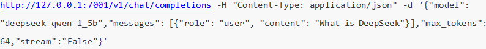
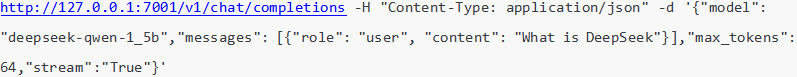
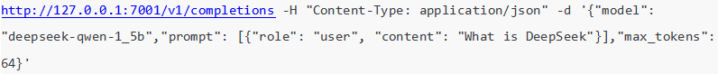

### Client
发送用户http请求至调度器，并等待调度器返回的流式（非流式）响应。

### 代码结构：
(1) **client.py**:提供接收http请求的cli接口，解析请求附带字段是否合法(配置合法字段见core.config)
。 用法：<u>python3 client.py</u>。 
&emsp;&emsp;可用两种模式： 
&emsp;&emsp;&emsp;&emsp; - chat_completion:对话模式，vllm根据系统提示词和上下文以对话的形式回答用户问题 
&emsp;&emsp;&emsp;&emsp; - completion:补全模式，vllm根据用户发送问题接着后面补全最优回复 

### 请求示例
示例以环回地址自测为例，实际使用url需要替换为scheduler的{ip_address:port} 
(1) chat模式非流式请求： 
   

(2) chat模式流式请求： 
   

(3) completion模式（强制非流式） 
   

