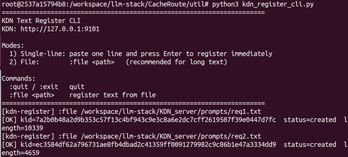
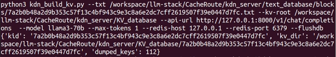
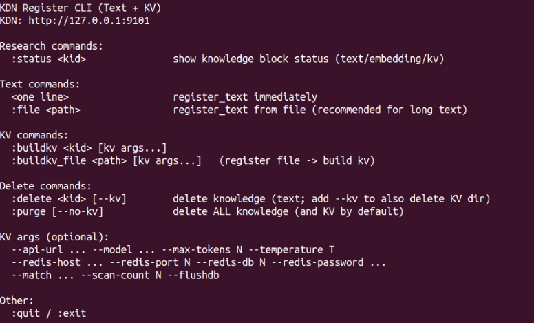
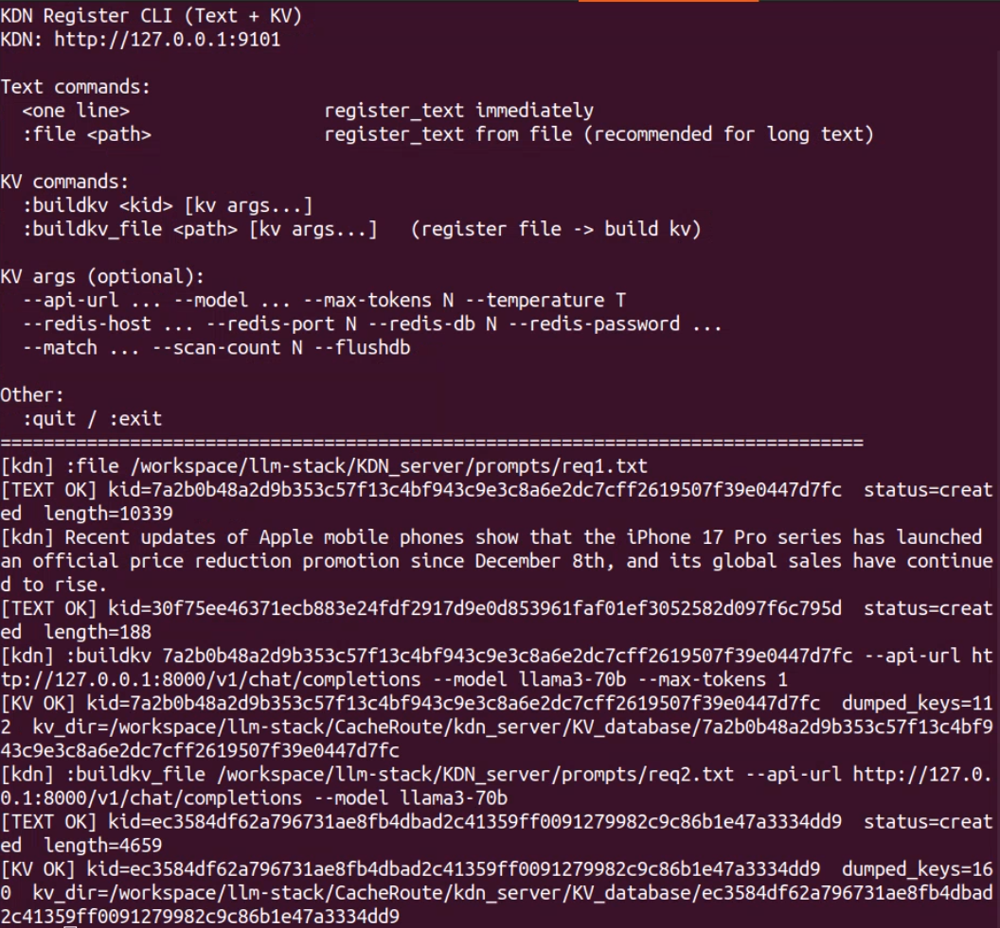
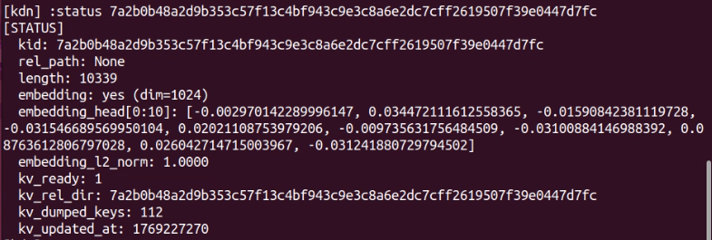
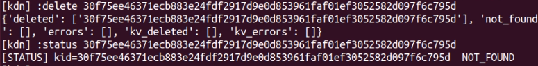
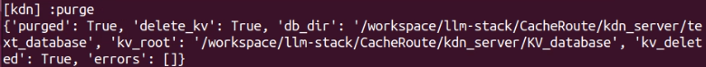

### KDN服务器
数据结构：<br>
kdn_server/<br>
&emsp;| KV_database/<br>
&emsp;| &emsp;| kid_ID/<br>
&emsp;| &emsp;| &emsp;|blocks/(dumps)<br>
&emsp;| &emsp;| &emsp;|manifest.jsonl<br>
&emsp;| text_database/<br>
&emsp;| &emsp;| blocks/(txt)<br>
&emsp;| &emsp;| tmp/<br>
&emsp;| &emsp;| index.sqlite3<br>
&emsp;| __init__.py<br>
&emsp;| kdn_api.py<br>
&emsp;| kdn_register_cli.py<br>
&emsp;| kv_builder.py<br>
&emsp;| kv_injector.py<br>
&emsp;| text_db.py<br>
&emsp;| README.md<br>

**KDN 服务器的POST路由**
```
@/knowledge/search/text: search text block in KDN, input: KEYS, output: text, length, embedding...
@/knowledge/register_text: register text block in KDN, input: text, output: data struct for text.
@/knowledge/delete: delete block in KDN, input KEYS
@/knowledge/purge_all: clean up KDN database
@/knowledge/snapshot: update list for scheduler
 ```

**1.1 知识文本注册**<br>
KDN对知识的注册分两步，第一步是对文本块知识的注册，KDN会基于文本内容生产hash索引命名，并构建存储单元结构数据。封装的接口位于`util/kdn_register_cli.py`内。执行该Python文件前首先需要确保KDN服务器启动（即`kdn_api.py`)
```
python3 kdn_server/kdn_api.py
python3 util/kdn_register_cli.py
```
会进入命令行窗口<br>
 <br>
支持直接输入小于4k的命令行文本进行知识注册，也支持对于长文件给予文件路径的知识块注册
```
 :file /path/to/the/file
```
会得到[ok]状态提示，显示注册结果。结构体包含[hash ID, length, file_path, embedding, embedding_dim]

**1.2 知识KVCache注册**<br>
KDN会使用已经注册知识的文本，送入模型生成KVCache，并落盘到KDN服务器本地。封装的接口位于`util/kdn_build_kv.py`，它基于`kv_builder`，支持将指定路径的文本送入模型生成KVCache并落盘到具体的路径下。命令结构为
```
在运行kdn_build_kv前，确保vLLM+LMCache引擎，KDN服务器和Redis服务器已经正常启动，具体命令见CacheRoute/README.md
python3 kdn_build_kv.py --txt /file/to/.txt --kv-root /path/for/save/kv_cache --api-url vLLM_url --model model_name --max tokens 1 --redis-host ip --redis-port 6379 --flushdb
```
由于一个文本块的KVCache会分为多片。KDN对一个知识块KVCache的存储放在一个目录内，并用其hash ID命名。内设blocks目录存储KVCache分片，并有manifest.jsonl和run_meta.json描述片段信息。<br>
 <br>

**1.3 知识KVCache注入**<br>
基于`kdn_server/kdn_injector.py`实现向Redis服务器的KVCache注入。具体指令为
```
python3 kv_injector.py --kv-dir /path/save/kvcache --redis-host ip --redis-port 6379
```
这个方法只是验证功能有效性，后续这个方法会封装在KDN匹配服务的流程内，无需自行调用。

**1.4 知识块信息查询**<br>
KDN_api对外暴露need_field接口，可以根据需求请求对应属性信息，目前开放的属性有：`content`,`length`,`rel_path`,`embedding`,`embed_dim`,`kv_ready`,`kv_rel_dir`,`kv_dumped_keys`,`kv_updated_at`,`embedding_head`，具体例如：
```
curl -s http://127.0.0.1:9101/knowledge/search/text -H "Content-Type: application/json" -d '{"knowledge_ids":["7a2b0b48a2d9b353c57f13c4bf943c9e3c8a6e2dc7cff2619507f39e0447d7fc"],"need_fields":["embedding","length"]}' | head -c 300
```

### **260123 KDN_CLI大更新**<br>
kdn_register_cli对所有KDN数据维护接口进行封装，支持文本注册，KV注册，知识块查询，知识块删除和数据库删除，具体启动方式为`kdn_server/kdn_register_cli.py`，启动后的交互界面如下，脚本内也对使用方法做了详细说明（支持非交互式）。<br>
<br>
(1) 文本注册:<br>
```
:file /workspace/llm-stack/KDN_server/prompts/req1.txt
也可以直接复制文字回车
``` 
(2) KV注册（注意Kids对应实际ID）:<br>
```
:buildkv 7a2b0b48a2d9b353c57f13c4bf943c9e3c8a6e2dc7cff2619507f39e0447d7fc --api-url http://127.0.0.1:8000/v1/chat/completions --model llama3-70b --max-tokens 1
```
(3) 最常用：文件 -> 注册 -> 构建 KV（最常用，后面可加 --flushdb，会清除Redis缓存，慎重）<br>
```
:buildkv_file /workspace/llm-stack/KDN_server/prompts/req2.txt --api-url http://127.0.0.1:8000/v1/chat/completions --model llama3-70b
```
<br>
(4) 支持查询知识块
```
:status 7a2b0b48a2d9b353c57f13c4bf943c9e3c8a6e2dc7cff2619507f39e0447d7fc
```
<br>
支持删除已有知识块
```
:delete 30f75ee46371ecb883e24fdf2917d9e0d853961faf01ef3052582d097f6c795d
```
<br>
支持清空数据库，默认文本和KV一起清除
```
:purge [--no-kv]
```
<br>

### 一次完整的外部知识注入流程：<br>
 - 通过`demo_kdn.py`开启KDN服务器，并开启`kdn_register_cli.py`打开KDN交互CLI。
 - 开启llm+LMCache+redis组合，见主页README.md
 - 在CLI内执行buildkv_file指令，指定文本路径和模型url，完成知识在kdn_server内的预热，例如：
```
:buildkv_file /workspace/llm-stack/CacheRoute/kdn_server/test1.txt --api-url http://127.0.0.1:8000/v1/chat/completions --model llama3-70b
```

 
 - 重启模型，为Redis服务器执行`FLUSHDB`清空缓存
 - 使用`kv_injector.py`注入刚刚准备好的知识条目到Redis，例如：
```
python3 kv_injector.py --kv-dir /workspace/llm-stack/CacheRoute/kdn_server/KV_database/a4da9fe548b2b2d66bb5cd1dae29f03a4c0c0eef88fe964757754cad878cc725 --redis-host 127.0.0.1 --redis-port 6379
```


 - 执行`test_kv_injector_reuse.py`，观察到被重用


